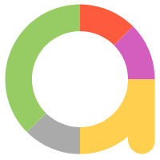

# Project with automated tests for Mercadona web app (desktop)
[Mercadona web page](https://www.mercadona.es/)


## :page_with_curl: Scope:

- <a href="#computer-сode_stack">Technology and tools</a>
- <a href="#clipboard-Test-cases">Test-cases</a>
- <a href="#Jenkins-job">Jenkins job</a>
- <a href="#keyboard-launch-from-terminal">Launch from terminal</a>
- <a href="#bar_chart-Test-results-report">Test results report</a>
- <a href="#robot-Telegram">Telegram Bot Notifications</a>
- <a href="#film_projector-Example-video-of-test-run-in-Selenoid">Example video of test-run in Selenoid</a>

## :computer: Technology and tools
<p align="left"> 





</p>

## :clipboard: Test-cases
- Check page console log for errors:heavy_check_mark:
- Check changing page's language :heavy_check_mark:
- Check main menu headers :heavy_check_mark:
- Check page title :heavy_check_mark:
- Check postal code settting :soon:

##  Jenkins job
[JENKINS](https://jenkins.autotests.cloud/job/Student12_Diplom_DemoProject/)


## :keyboard: Launch from terminal
Local launch:
```
gradle clean test
```


Remote launch:
```
clean
test
-Dbrowser=${BROWSER}
-DbrowserVersion=${BROWSER_VERSION}
-DbrowserSize=${BROWSER_SIZE}
-DremoteDriverUrl=https://${REMOTE_DRIVER_LOGIN}:${REMOTE_DRIVER_PASSWORD}@${REMOTE_DRIVER_URL}/wd/hub/
```
### Build parameters

> <code>BROWSER</code> – browser, where test will run (_by deafult - <code>chrome</code>_).
>
> <code>BROWSER_VERSION</code> – browser's version (_by deafult - <code>100.0</code>_).
>
> <code>BROWSER_SIZE</code> – window size (_by deafult- <code>1920x1080</code>_).
> 
> <code>BROWSER_MOBILE</code> – mobile browser.
>
> <code>REMOTE_URL</code> – remote browser.
> 
> <code>LOGIN_REMOTE</code> –login selenoid.
> 
> <code>PASSWORD_REMOTE</code> – password selenoid.
> 
> <code>THREADS</code> – number of threads.

##  Test results report [Allure Report](https://jenkins.autotests.cloud/job/Student12_Diplom_DemoProject/14/allure/)

### :pushpin: Overview page Allure-report


### :pushpin: Behavior page


### :pushpin: Graph Page


##  Telegram Bot Notifications

> When build is completed,  the message with test result is sent by bot created in <code>Telegram</code> automatically 


##  Example video of test-run in Selenoid

Every test contains last screenshots, page source, browser console logs, video in attachments. One of this viedo can see below.
<p align="center">

</p>
